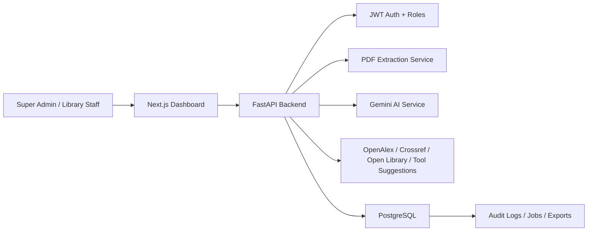

# RCAABUT Dashboard System Design

## Purpose

The RCAABUT Dashboard is a prototype automation and review layer for Covenant University Library's course resource repository workflow. It does not write directly into the live RCAABUT platform. Instead, it extracts course compact topics, discovers resource candidates, supports staff review, and exports approved records in a repository-ready structure.

## Actors

- Super Admin: manages users, resets passwords, manages source connectors, and can access all dashboard workflows.
- Library Staff: uploads course compacts, edits topics, generates resources, reviews/approves records, and exports repository-ready data.

Disabled users cannot log in, and protected API routes re-check account activity on every request so stale tokens stop working after a Super Admin disables an account.
The user-management API also prevents a Super Admin from disabling or demoting their own account and prevents updates that would remove the last active Super Admin.

## Main Workflow

1. Super Admin signs in with the seeded account.
2. Super Admin creates Library Staff users and can reset staff passwords.
3. Library Staff uploads a Covenant University course compact PDF.
4. Backend extracts PDF text using `pypdf`.
5. Gemini parses course metadata and weekly topics when configured.
6. Fallback parsers handle clean module/week formats, word-number weeks, and portal-table compacts.
7. Library Staff reviews, edits, adds, or deletes extracted topics.
8. Library Staff confirms topics; resource generation is rejected until this review gate is complete and at least one teaching topic remains searchable.
9. The resource generation job searches enabled metadata connectors.
10. Gemini reranks/classifies connector candidates when configured.
11. The system stores the top 5 candidates per searchable topic.
12. Library Staff edits, approves, rejects, or manually adds resources.
13. Approved records can be corrected or removed before export.
14. The dashboard previews approved records by topic, category, and resource number, then exports the same structure as JSON/CSV data for RCAABUT integration and readable HTML for presentation/review.

## Architecture

## Backend Modules

- `app/api/auth.py`: login and current-user endpoint.
- `app/api/users.py`: Super Admin user management.
- `app/api/compacts.py`: PDF upload and extraction job creation.
- `app/api/courses.py`: course, topic, candidate, approval, archive, and export workflow.
- `app/api/sources.py`: source connector management.
- `app/api/reports.py`: activity, export history, stored export download, and evaluation metrics.
- `app/db/init_db.py`: idempotent database setup and default seed data.
- `app/services/gemini.py`: AI parser and reranker abstractions.
- `app/services/connectors.py`: open metadata discovery connectors.
- `app/services/fallbacks.py`: deterministic parsers and fallback resource generation.

## Frontend Modules

- `src/app/page.tsx`: operational dashboard and workflow controls.
- `src/lib/api.ts`: API request helper and error wrapper.
- `src/types/index.ts`: shared frontend data types.

## Important Design Decisions

- The system is a prototype/export layer, not a live RCAABUT database writer.
- PDFs are processed through temporary files; extracted text and structured data are stored in the database.
- Course archive is soft and auditable. Archived courses remain visible for review and restore, but mutation, generation, and new export endpoints reject changes until restore. Restore uses the archive audit record to return the course to its previous workflow status.
- Course metadata updates do not mutate workflow status; status transitions are controlled by dedicated review, generation, export, archive, and restore actions.
- Re-approving a candidate updates the existing approved record instead of creating duplicates.
- Rejecting a previously approved candidate removes the linked approved record so the review queue and export preview stay consistent.
- Marking a topic non-searchable removes generated and approved resources for that topic, and manual approved resources can only be attached to searchable teaching topics.
- Source connectors are configurable by Super Admin.
- The activity log records upload, extraction, generation, review, export, source, user, and archive events so the prototype can show traceability during evaluation.
- Export generation is stored in export history and written to the activity log.
- Gemini is used through service abstractions so the implementation can later be swapped to local models or embeddings.
- Database setup is explicit and repeatable through `python -m app.db.init_db`, while API startup also calls the initializer as a local-development safeguard.
